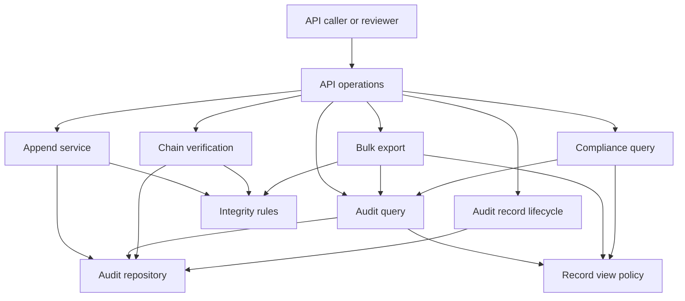

# Functional Architecture

## Purpose

Define the minimum logical architecture needed to satisfy the audit-log prototype requirements. Components are named by responsibility and remain modules within one application unless a future requirement justifies extraction.

## Logical View

## Components

### API Operations

**Inputs:** Event writes, query filters, pagination, verification requests, lifecycle requests, export requests, and the clarified compliance request.

**Outputs:** Validation responses, stored-record acknowledgements, paged results, verification outcomes, lifecycle results, export bundles, and compliance results.

**Owned decisions:**

- External request and response contracts.
- Request-shape validation and error format.
- Which operations are exposed.
- Prototype authorization assumptions for sensitive operations.
- Confirmation that no general event update or delete operation is exposed.

**Dependencies:** All application-operation modules.

The API layer must not compute hashes, query persistence directly, perform lifecycle decisions, or construct export proofs.

### Append Service

**Inputs:** Validated event fields and the documented timestamp policy.

**Outputs:** Completed stored record, stable record identifier, and acknowledgement or failure.

**Owned decisions:**

- Event validation beyond request shape.
- Timestamp assignment.
- Record identity and ordering.
- Authoritative predecessor selection.
- Concurrent append behavior.
- Atomic completion of hash construction and persistence.
- Point at which a write is considered successful.

**Dependencies:** Integrity Rules and Audit Repository.

### Integrity Rules

**Inputs:** Event fields, predecessor integrity metadata, genesis value, and persisted lifecycle evidence during verification.

**Outputs:** Canonical hash input, content hash, predecessor link, and deterministic verification calculations.

**Owned decisions:**

- Hash-covered fields.
- Canonical record representation.
- Hash algorithm.
- Genesis value.
- Chain scope.
- Supported integrity calculations.

**Dependencies:** None of the API or persistence implementations. Both Append Service and Chain Verification consume the same rules.

### Audit Repository

**Inputs:** Completed audit records and authorized lifecycle evidence.

**Outputs:** Atomic append result, ordered records, filtered records, lifecycle evidence, and data used for database-inspection tests.

**Owned decisions:**

- Persistence contract.
- Atomic append behavior.
- Ordered and filtered retrieval primitives.
- Storage representation of records and lifecycle evidence.

**Dependencies:** Integrity and lifecycle data contracts.

The repository does not decide retention eligibility, redaction authorization, query visibility, or export disclosure.

### Audit Query

**Inputs:** Any supported combination of `actorId`, `resourceType` plus `resourceId`, `eventType`, `from` / `to`, and pagination.

**Outputs:** Ordered, paged records in the permitted representation.

**Owned decisions:**

- Filter-combination behavior.
- Time-boundary semantics.
- Default ordering.
- Pagination contract.

**Dependencies:** Audit Repository and Record View Policy.

### Audit Record Lifecycle

This boundary contains separate retention and structured-redaction operations while sharing l×Ï7ÒÚ$z{-®éÜj×�'&VÆF–öâÔ–B"Â4õ%$TÄD”ôåô”B�¢æ6öçFVçEG—R„ÖVF–G—RäÄ”4D”ôåô¥4ôâ�¢æ6öçFVçB‚"" ¢°¢&WfVçEG—R#¢&–çfÆ–BG—R"À¢&WfVçE66†VÖfW'6–öâ#¢À¢'–ÆöB#¢·Ğ¢Ğ¢"""’�¢ææDW‡V7B‡7FGW2‚’æ—4&E&WVW7B‚’�¢ææDW‡V7B††VFW"‚’ç7G&–ær‚%‚Ô6÷'&VÆF–öâÔ–B"Â4õ%$TÄD”ôåô”B’�¢ææDW‡V7B†§6öåF‚‚"Bæ6öFR"’çfÇVR‚$”ådÄ”Eõ$UTU5B"’�¢ææDW‡V7B†§6öåF‚‚"Bæ6÷'&VÆF–öä–B"’çfÇVR„4õ%$TÄD”ôåô”B’�¢ææDW‡V7B†§6öåF‚‚"Bçf–öÆF–öç2"†56—¦RƒR’’�¢ææDW‡V7B†6öçFVçB‚’ç7G&–ær†æ÷B†6öçF–ç57G&–ær‚&¦¶'FçfÆ–FF–öâ"’’’�¢ææDW‡V7B†6öçFVçB‚’ç7G&–ær†æ÷B†6öçF–ç57G&–ær‚'&V¦V7FVEfÇVR"’’’�¢ææDW‡V7B†6öçFVçB‚’ç7G&–ær†æ÷B†6öçF–ç57G&–ær‚'7F6µG&6R"’’’“°¢Ğ ¢FW7@¢fö–B6öæfÆ–7F–æt–FV×÷FVæ7”¶W•&WGW&ç3C•v—F†÷WD÷&–v–æÄFF€¢6GW&VD÷WGWB÷WGW@¢’F‡&÷w2W†6WF–öâ°¢v—fVâ†7&VFTVF—DWfVçBæ7&VFR†W„”DTÕõDTä5•ô´U’’Âç’‚’’�¢çv–ÆÅF‡&÷r†æWr–FV×÷FVæ7”¶W•&WW6VDW†6WF–öâ‚’“° ¢Öö6´×f2çW&f÷&Ò‡fÆ–E&WVW7B‚'6V7&WBÖ66÷VçB×fÇVR"’�¢ææDW‡V7B‡7FGW2‚’æ—46öæfÆ–7B‚’�¢ææDW‡V7B†§6öåF‚‚"Bæ6öFR"’çfÇVR‚$”DTÕõDTä5•ô´U•õ$UU4TB"’�¢ææDW‡V7B†§6öåF‚‚"Bæ6÷'&VÆF–öä–B"’çfÇVR„4õ%$TÄD”ôåô”B’�¢ææDW‡V7B†§6öåF‚‚"Bçf–öÆF–öç2"†56—¦Rƒ’’�¢ææDW‡V7B†6öçFVçB‚’ç7G&–ær†æ÷B†6öçF–ç57G&–ær‚'6V7&WBÖ66÷VçB×fÇVR"’’’�¢ææDW‡V7B†6öçFVçB‚’ç7G&–ær†æ÷B†6öçF–ç57G&–ær‚&f–ævW'&–çB"’’’�¢ææDW‡V7B†6öçFVçB‚’ç7G&–ær†æ÷B†6öçF–ç57G&–ær‚'7F6µG&6R"’’’“° ¢76W'EF†B†÷WGWB’æ6öçF–ç2‚$”DTÕõDTä5•ô´U•õ$UU4TB"�¢æ6öçF–ç2„4õ%$TÄD”ôåô”B�¢æFöW4æ÷D6öçF–â‚'6V7&WBÖ66÷VçB×fÇVR"�¢æFöW4æ÷D6öçF–â‚&f–ævW'&–çB"�¢æFöW4æ÷D6öçF–â‚'7F6µG&6R"“°¢Ğ ¢FW7@¢fö–B÷fW'6—¦VE–ÆöE&WGW&ç3C5v—F†÷WDV6†ö–æu–ÆöB€¢6GW&VD÷WGWB÷WGW@¢’F‡&÷w2W†6WF–öâ°¢v—fVâ†7&VFTVF—DWfVçBæ7&VFR†W„”DTÕõDTä5•ô´U’’Âç’‚’’�¢çv–ÆÅF‡&÷r†æWr–ÆöEFöôÆ&vTW†6WF–öâ‚’“° ¢Öö6´×f2çW&f÷&Ò‡fÆ–E&WVW7B‚'6Vç6—F—fR×–ÆöBÖÖ&¶W""’�¢ææDW‡V7B‡7FGW2‚’æ—5–ÆöEFöôÆ&vR‚’�¢ææDW‡V7B†§6öåF‚‚"Bæ6öFR"’çfÇVR‚%”ÄôEôĔԕEôU„4TTDTB"’�¢ææDW‡V7B†§6öåF‚‚"BæÖW76vR"’çfÇVR‚%F†R&WVW7BW†6VVG2F†RW&Ö—GFVB6—¦Râ"’�¢ææDW‡V7B†§6öåF‚‚"Bæ6÷'&VÆF–öä–B"’çfÇVR„4õ%$TÄD”ôåô”B’�¢ææDW‡V7B†6öçFVçB‚’ç7G&–ær†æ÷B†6öçF–ç57G&–ær‚'6Vç6—F—fR×–ÆöBÖÖ&¶W""’’’�¢ææDW‡V7B†6öçFVçB‚’ç7G&–ær†æ÷B†6öçF–ç57G&–ær‚%–ÆöEFöôÆ&vTW†6WF–öâ"’’’�¢ææDW‡V7B†6öçFVçB‚’ç7G&–ær†æ÷B†6öçF–ç57G&–ær‚'7F6µG&6R"’’’“° ¢76W'EF†B†÷WGWB’æ6öçF–ç2‚%”ÄôEôĔԕEôU„4TTDTB"�¢æ6öçF–ç2„4õ%$TÄD”ôåô”B�¢æFöW4æ÷D6öçF–â‚'6Vç6—F—fR×–ÆöBÖÖ&¶W""�¢æFöW4æ÷D6öçF–â‚%–ÆöEFöôÆ&vTW†6WF–öâ"�¢æFöW4æ÷D6öçF–â‚'7F6µG&6R"“°¢Ğ ¢FW7@¢fö–BVæW‡V7FVDf–ÇW&U&WGW&ç4f—†VCSv—F†÷WDW†6WF–öäFWF–Ç2€¢6GW&VD÷WGWB÷WGW@¢’F‡&÷w2W†6WF–öâ°¢v—fVâ†7&VFTVF—DWfVçBæ7&VFR†W„”DTÕõDTä5•ô´U’’Âç’‚’’�¢çv–ÆÅF‡&÷r†æWr'VçF–ÖTW†6WF–ö•&f—‡GW&R×6Vç6—F—fRÖFF&6RÖFWF–Â"’“° ¢Öö6´×f2çW&f÷&Ò‡fÆ–E&WVW7B‚'6Vç6—F—fR×–ÆöBÖÖ&¶W""’�¢ææDW‡V7B‡7FGW2‚’æ—4–çFW&æÅ6W'fW$W'&÷"‚’�¢ææDW‡V7B†§6öåF‚‚"Bæ6öFR"’çfÇVR‚$”åDU$äÅôU%$õ""’�¢ææDW‡V7B†§6öåF‚‚"BæÖW76vR"’çfÇVR‚%F†R&WVW7B6÷VÆBæ÷B&R6ö×ÆWFVBâ"’�¢ææDW‡V7B†6öçFVçB‚’ç7G&–ær†æ÷B†6öçF–ç57G&–ær‚&f—‡GW&R×6Vç6—F—fRÖFF&6RÖFWF–Â"’’’�¢ææDW‡V7B†6öçFVçB‚’ç7G&–ær†æ÷B†6öçF–ç57G&–ær‚'6VÆV7B¢"’’’�¢ææDW‡V7B†6öçFVçB‚’ç7G&–ær†æ÷B†6öçF–ç57G&–ær‚%'VçF–ÖTW†6WF–öâ"’’’�¢ææDW‡V7B†6öçFVçB‚’ç7G&–ær†æ÷B†6öçF–ç57G&–ær‚'7F6µG&6R"’’’“° ¢76W'EF†B†÷WGWB’æ6öçF–ç2‚$”åDU$äÅôU%$õ""�¢æ6öçF–ç2„4õ%$TÄD”ôåô”B�¢æFöW4æ÷D6öçF–â‚&f—‡GW&R×6Vç6—F—fRÖFF&6RÖFWF–Â"�¢æFöW4æ÷D6öçF–â‚'6VÆV7B¢"�¢æFöW4æ÷D6öçF–â‚%'VçF–ÖTW†6WF–öâ"�¢æFöW4æ÷D6öçF–â‚'7F6µG&6R"“°¢Ğ ¢FW7@¢fö–B6ö×ÆWFVD–çfÆ–EfW&–f–6F–öå&WGW&ç3#v—F…&V6öâ‚’F‡&÷w2W†6WF–öâ°¢v—fVâ†6†–åfW&–f–6F–öâçfW&–g’‚'FVæçC§FVæçBÓ"’’çv–ÆÅ&WGW&•fW&–f–6F–öå&W7VÇBæ–çfÆ–B€¢fW&–f–6F–öå&W7VÇBäf–ÇW&U&V6öâä4ôåDTåEô„4…ôÔ•4ÔD4‚À¢"ÂÂÂÂÂÀ¢%F†R7F÷&VB6öçFVçB†6‚FöW2æ÷BÖF6‚F†R&V6Æ7VÆFVB†6‚â ¢�¢“° ¢Öö6´×f2çW&f÷&Ò†vWB€¢D‚²"ö6†–ç2÷FVæçC§FVæçBÓ÷fW&–f–6F–öâ ¢’�¢ææDW‡V7B‡7FGW2‚’æ—4ö²‚’�¢ææDW‡V7B†§6öåF‚‚"Bç7FGW2"’çfÇVR‚$”ådÄ”B"’�¢ææDW‡V7B†§6öåF‚‚"BçfÆ–B"’çfÇVR†fÇ6R’�¢ææDW‡V7B†§6öåF‚‚"Bæf–ÇW&U&V6öâ"�¢çfÇVR‚$4ôåDTåEô„4…ôÔ•4ÔD4‚"’�¢ææDW‡V7B†§6öåF‚‚"Bæf–ÇW&U6WVVæ6R"’çfÇVRƒ"’“°¢Ğ ¢FW7@¢fö–BÖÆf÷&ÖVD7W'6÷%&WGW&ç3Cv—F†÷WDÆövv–æt7W'6÷"€¢6GW&VD÷WGWB÷WGW@¢’F‡&÷w2W†6WF–öâ°¢7G&–ær&t7W'6÷"Ò'6Vç6—F—fRÖ–çfÆ–BÖ7W'6÷"#°¢v—fVâ†6öçFW‡E&÷f–FW"æ7W'&VçD6öçFW‡B‚’’çv–ÆÅ&WGW&•æWrVF—E&WVW7D6öçFW‡B€¢'FVæçBÓ"Â'&öGV6W"Ó"Â&7F÷"Ó"À¢%U4U""Â$UD„TåD”4DTEõ$”ä4• ¢�¢“°¢v—fVâ†VF—EVW'’ç6V&6‚€¢W‚'FVæçBÓ"’À¢ç’„VF—DWfVçE7V6–f–6F–öâæ6Æ72’À¢WƒS’À¢W‡&t7W'6÷"�¢’’çv–ÆÅF‡&÷r†æWr–çfÆ–D7W'6÷$W†6WF–ö•–çfÆ–D7W'6÷$W†6WF–öâå&V6öâäÔÄdõ$ÔT@¢’“° ¢Öö6´×f2çW&f÷&Ò†vWB…D‚�¢ç&Ò‚&7W'6÷""Â&t7W'6÷"�¢æ†VFW"‚%‚Ô6÷'&VÆF–öâÔ–B"Â4õ%$TÄD”ôåô”B’�¢ææDW‡V7B‡7FGW2‚’æ—4&E&WVW7B‚’�¢ææDW‡V7B†§6öåF‚‚"Bæ6öFR"’çfÇVR‚$5U%4õ%ôÔÄdõ$ÔTB"’�¢ææDW‡V7B†§6öåF‚‚"Bæ6÷'&VÆF–öä–B"’çfÇVR„4õ%$TÄD”ôåô”B’�¢ææDW‡V7B†6öçFVçB‚’ç7G&–ær†æ÷B†6öçF–ç57G&–ær‡&t7W'6÷"’’’“° ¢76W'EF†B†÷WGWB’æ6öçF–ç2‚$5U%4õ%ôÔÄdõ$ÔTB"�¢æ6öçF–ç2„4õ%$TÄD”ôåô”B�¢æFöW4æ÷D6öçF–â‡&t7W'6÷"“°¢Ğ ¢FW7@¢fö–BW††W7FVD6†–äÆö6µ&WGW&ç3S5v—F…&WG'”gFW"€¢6GW&VD÷WGWB÷WGW@¢’F‡&÷w2W†6WF–öâ°¢v—fVâ†7&VFTVF—DWfVçBæ7&VFR†W„”DTÕõDTä5•ô´U’’Âç’‚’’�¢çv–ÆÅF‡&÷r†æWr6†–ä'W7”W†6WF–ö•æWr'VçF–ÖTW†6WF–öâ‚'6Vç6—F—fRÆö6²FWF–Â"�¢’“° ¢Öö6´×f2çW&f÷&Ò‡fÆ–E&WVW7B‚'6Vç6—F—fR×–ÆöBÖÖ&¶W""’�¢ææDW‡V7B‡7FGW2‚’æ—56W'f–6UVæf–Æ&ÆR‚’�¢ææDW‡V7B††VFW"‚’ç7G&–ær‚%&WG'’ÔgFW""Â#"’�¢ææDW‡V7B†§6öåF‚‚"Bæ6öFR"’çfÇVR‚$4„”åô%U5’"’�¢ææDW‡V7B†§6öåF‚‚"Bæ6÷'&VÆF–öä–B"’çfÇVR„4õ%$TÄD”ôåô”B’�¢ææDW‡V7B†6öçFVçB‚’ç7G&–ær†æ÷B€¢6öçF–ç57G&–ær‚'6Vç6—F—fRÆö6²FWF–Â"�¢’’“° ¢76W'EF†B†÷WGWB’æ6öçF–ç2‚$4„”åô%U5’"�¢æ6öçF–ç2„4õ%$TÄD”ôåô”B�¢æFöW4æ÷D6öçF–â‚'6Vç6—F—fRÆö6²FWF–Â"�¢æFöW4æ÷D6öçF–â‚'6Vç6—F—fR×–ÆöBÖÖ&¶W""“°¢Ğ ¢FW7@¢fö–BG&ç6–VçD6öææV7F–öäf–ÇW&U&WGW&ç56æ—F—¦VCS2€¢6GW&VD÷WGWB÷WGW@¢’F‡&÷w2W†6WF–öâ°¢v—fVâ†7&VFTVF—DWfVçBæ7&VFR†W„”DTÕõDTä5•ô´U’’Âç’‚’’�¢çv–ÆÅF‡&÷r†æWrFV×÷&'”FF&6Tf–ÇW&TW†6WF–ö•æWr'VçF–ÖTW†6WF–ö•&f—‡GW&R×6Vç6—F—fRÖ6öææV7F–öâÖFWF– ¢�¢’“° ¢Öö6´×f2çW&f÷&Ò‡fÆ–E&WVW7B‚'–ÆöB×fÇVR"’�¢ææDW‡V7B‡7FGW2‚’æ—56W'f–6UVæf–Æ&ÆR‚’�¢ææDW‡V7B†§6öåF‚‚"Bæ6öFR"�¢çfÇVR‚%DTÕõ$%•ôDD$4Uôd”ÅU$R"’�¢ææDW‡V7B†§6öåF‚‚"Bæ6÷'&VÆF–öä–B"’çfÇVR„4õ%$TÄD”ôåô”B’�¢ææDW‡V7B†6öçFVçB‚’ç7G&–ær†æ÷B†6öçF–ç57G&–ær‚&F"×6V7&WB"’’’�¢ææDW‡V7B†6öçFVçB‚’ç7G&–ær†æ÷B†6öçF–ç57G&–ær‚'–ÆöB×fÇVR"’’’“° ¢76W'EF†B†÷WGWB’æ6öçF–ç2‚%DTÕõ$%•ôDD$4Uôd”ÅU$R"�¢æ6öçF–ç2„4õ%$TÄD”ôåô”B�¢æFöW4æ÷D6öçF–â‚&F"×6V7&WB"�¢æFöW4æ÷D6öçF–â‚&f—‡GW&R×6Vç6—F—fRÖ6öææV7F–öâÖFWF–Â"�¢æFöW4æ÷D6öçF–â‚'–ÆöB×fÇVR"“°¢Ğ ¢FW7@¢fö–B7V66W76gVÄ7&VFU&WGW&ç4GW&&ÆU&V6V—B‚’F‡&÷w2W†6WF–öâ°¢UT”BWfVçD–BÒUT”Bæg&öÕ7G&–ær‚#ÓÓÓÓ"“°¢VF—DWfVçE&W7öç6R&W7öç6RÒæWrVF—DWfVçE&W7öç6R€¢WfVçD–BÀ¢'FVæçC§FVæçBÓ"À¢À¢–ç7FçBç'6R‚###bÓ‚ÓuCC£3£"ãCSe¢"’À¢&"ç&WVBƒcB’À¢%4„Ó#Sb"À¢¢“°¢v—fVâ†7&VFTVF—DWfVçBæ7&VFR†W„”DTÕõDTä5•ô´U’’Âç’‚’’�¢çv–ÆÅ&WGW&â†æWr7&VFTVF—DWfVçE&W7VÇB‡&W7öç6RÂfÇ6R’“° ¢Öö6´×f2çW&f÷&Ò‡fÆ–E&WVW7B‚&66÷VçBÓ"’�¢ææDW‡V7B‡7FGW2‚’æ—47&VFVB‚’�¢ææDW‡V7B††VFW"‚’ç7G&–ær€¢$Æö6F–öâ"À¢"÷cöVF—BöWfVçG2ò"²WfVçD–@¢’�¢ææDW‡V7B††VFW"‚’ç7G&–ær‚$–FV×÷FVæ7’Õ&WÆ–VB"Â&fÇ6R"’�¢ææDW‡V7B†§6öåF‚‚"BæWfVçD–B"’çfÇVR†WfVçD–BçFõ7G&–ær‚’’�¢ææDW‡V7B†§6öåF‚‚"Bç6WVVæ6TçVÖ&W""’çfÇVRƒ’“°¢Ğ ¢&—fFR÷&rç7&–ævg&ÖWv÷&²çFW7BçvV"ç6W'fÆWBç&WVW7BäÖö6´‡GG6W'fÆWE&WVW7D'V–ÆFW ¢fÆ–E&WVW7B…7G&–ær&W6÷W&6T–B’°¢&WGW&â÷7B…D‚�¢æ†VFW"‚$–FV×÷FVæ7’Ô¶W’"”DTÕõDTä5•ô´U’�¢æ†VFW"‚%‚Ô6÷'&VÆF–öâÔ–B"Â4õ%$TÄD”ôåô”B�¢æ6öçFVçEG—R„ÖVF–G—RäÄ”4D”ôåô¥4ôâ�¢æ6öçFVçB‚"" ¢°¢&WfVçEG—R#¢$44õTåEõUDDTB"À¢&WfVçE66†VÖfW'6–öâ#¢À¢&ö67W'&VDB#¢###bÓ‚ÓuCC£3£"ã#5¢"À¢&7F÷"#¢°¢&–B#¢&V×Æ÷–VRÓC""À¢'G—R#¢%U4U" ¢ÒÀ¢'&W6÷W&6R#¢°¢'G—R#¢$44õTåB"À¢&–B#¢"W2 ¢ÒÀ¢'–ÆöB#¢°¢&6†ævVDf–VÆG2#¢²&FG&W72%ТТТ"""æf÷&ÖGFVB‡&W6÷W&6T–B’“°¢ЧР