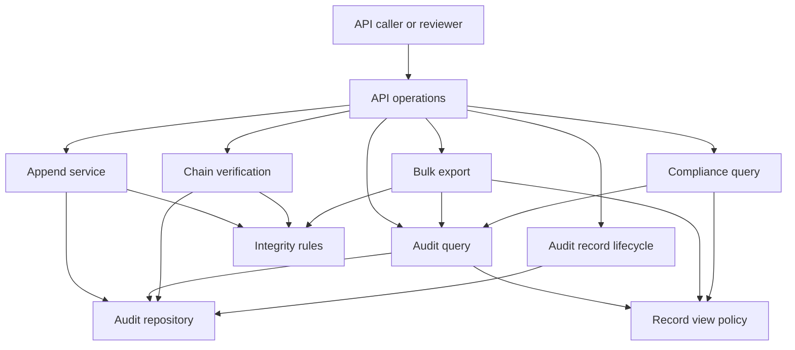

# Functional Architecture

## Purpose

Define the minimum logical architecture needed to satisfy the audit-log prototype requirements. Components are named by responsibility and remain modules within one application unless a future requirement justifies extraction.

## Logical View

## Components

### API Operations

**Inputs:** Event writes, query filters, pagination, verification requests, lifecycle requests, export requests, and the clarified compliance request.

**Outputs:** Validation responses, stored-record acknowledgements, paged results, verification outcomes, lifecycle results, export bundles, and compliance results.

**Owned decisions:**

- External request and response contracts.
- Request-shape validation and error format.
- Which operations are exposed.
- Prototype authorization assumptions for sensitive operations.
- Confirmation that no general event update or delete operation is exposed.

**Dependencies:** All application-operation modules.

The API layer must not compute hashes, query persistence directly, perform lifecycle decisions, or construct export proofs.

### Append Service

**Inputs:** Validated event fields and the documented timestamp policy.

**Outputs:** Completed stored record, stable record identifier, and acknowledgement or failure.

**Owned decisions:**

- Event validation beyond request shape.
- Timestamp assignment.
- Record identity and ordering.
- Authoritative predecessor selection.
- Concurrent append behavior.
- Atomic completion of hash construction and persistence.
- Point at which a write is considered successful.

**Dependencies:** Integrity Rules and Audit Repository.

### Integrity Rules

**Inputs:** Event fields, predecessor integrity metadata, genesis value, and persisted lifecycle evidence during verification.

**Outputs:** Canonical hash input, content hash, predecessor link, and deterministic verification calculations.

**Owned decisions:**

- Hash-covered fields.
- Canonical record representation.
- Hash algorithm.
- Genesis value.
- Chain scope.
- Supported integrity calculations.

**Dependencies:** None of the API or persistence implementations. Both Append Service and Chain Verification consume the same rules.

### Audit Repository

**Inputs:** Completed audit records and authorized lifecycle evidence.

**Outputs:** Atomic append result, ordered records, filtered records, lifecycle evidence, and data used for database-inspection tests.

**Owned decisions:**

- Persistence contract.
- Atomic append behavior.
- Ordered and filtered retrieval primitives.
- Storage representation of records and lifecycle evidence.

**Dependencies:** Integrity and lifecycle data contracts.

The repository does not decide retention eligibility, redaction authorization, query visibility, or export disclosure.

### Audit Query

**Inputs:** Any supported combination of `actorId`, `resourceType` plus `resourceId`, `eventType`, `from` / `to`, and pagination.

**Outputs:** Ordered, paged records in the permitted representation.

**Owned decisions:**

- Filter-combination behavior.
- Time-boundary semantics.
- Default ordering.
- Pagination contract.

**Dependencies:** Audit Repository and Record View Policy.

### Audit Record Lifecycle

This boundary contains separate retention and structured-redaction operations while sharing lifecycle-evidence conventions.

#### Retention

**Inputs:** Retention window, current time, record timestamp/state, and an explicit or scheduled retention trigger.

**Outputs:** Retention outcome and persisted evidence sufficient for verification.

**Owned decisions:**

- Archival or soft-deletion behavior selected for the prototype.
- Eligibility and time-window calculation.
- Evidence retained after the action.
- Distinction between authorized retention and unauthorized removal.

#### Structured Redaction

**Inputs:** Target record and field, configured redactable fields, and documented authorization assumption.

**Outputs:** Privacy-safe representation, redaction outcome, and persisted verification evidence.

**Owned decisions:**

- Eligible fields.
- Redaction representation.
- Metadata retained about the action.
- Whether an original value remains recoverable.
- What normal retrieval and export may disclose.

**Shared dependencies:** Audit Repository, Record View Policy, and Integrity Rules.

Lifecycle operations are not general update or delete operations.

### Record View Policy

**Inputs:** Stored record, retention state, redaction state, and intended use: normal query, compliance result, or export.

**Outputs:** Permitted representation for that use.

**Owned decisions:**

- Visibility of retained records.
- Visibility of redacted values.
- Consistent representation across query, compliance, and export.

**Dependencies:** Persisted lifecycle evidence and documented policy assumptions.

### Chain Verification

**Inputs:** Ordered records, integrity rules, genesis value, and persisted lifecycle evidence.

**Outputs:** `intact` or `broken`; first inconsistent record; supported violation type.

**Owned decisions:**

- Verification traversal.
- First-inconsistency selection.
- Violation classification.
- Independent evaluation of retention and redaction evidence.

**Dependencies:** Audit Repository and Integrity Rules.

Verification does not ask lifecycle modules to approve their own actions; it evaluates persisted evidence independently.

### Bulk Export

**Inputs:** `actorId` or `resourceId`, selected records, permitted views, and integrity metadata.

**Outputs:** Self-contained bundle, manifest, and independently verifiable proof data.

**Owned decisions:**

- Bundle contract and included metadata.
- Treatment of retained and redacted records.
- Proof semantics for a filtered record set.
- Meaning of “not altered since export.”

**Dependencies:** Audit Query, Record View Policy, Integrity Rules, and Export Verification contract.

### Export Verification

**Inputs:** Export bundle and manifest.

**Outputs:** Valid or invalid result and, where supported, the failed record or proof.

**Owned decisions:** Deterministic bundle-validation procedure and supported failure reporting.

**Dependencies:** The shared bundle contract and Integrity Rules.

This may be an independently executable module or test utility, not a deployed service.

### Compliance Query

**Inputs:** Clarified meanings of access and client account data, actors, resources, event types, reporting period, assumptions, and exclusions.

**Outputs:** Scoped compliance result with traceability to underlying audit records.

**Owned decisions:**

- Which events qualify.
- Required output fields.
- Reporting population.
- Implemented scope and exclusions.

**Dependencies:** Audit Query and Record View Policy.

It reuses normal query behavior rather than becoming a second query engine.

## Synchronization Boundaries

### Synchronous

- Event validation, predecessor selection, hash construction, atomic persistence, and write acknowledgement.
- Query and pagination.
- Chain verification. The assignment names `GET /audit/verify`; the implemented
  versioned route is `GET /v1/audit/events/chains/{chainId}/verification`.
- Structured redaction for the prototype.
- Narrow compliance query.
- Bulk Export for the prototype dataset.

A successful response must not precede completion of the claimed business effect.

### May Be Asynchronous

- Retention processing, provided eligibility, progress, completion, and post-retention verification remain observable.
- Production-scale export generation, if a job-status contract is added.
- Scheduled integrity verification as an optional supplement.
- Archival transfer after required verification evidence is safely persisted.

The prototype may keep these operations synchronous to avoid unnecessary transition states.

### Must Not Be Eventually Reconciled

- Authoritative predecessor selection.
- Integrity metadata for an acknowledged write.
- Persistence of an acknowledged event.
- Removal of sensitive data after reporting redaction success.
- Lifecycle evidence after the corresponding record has already been removed.
- Export delivery before its manifest and proof metadata are complete.

## Dependency Sequence

1. Define identity, ordering, timestamp, hash inputs, genesis value, and chain scope.
2. Establish record and lifecycle-evidence contracts.
3. Implement atomic append and Integrity Rules.
4. Implement query and base verification.
5. Add retention and extend independent verification.
6. Add redaction, Record View Policy, and verification behavior.
7. Add export and independent bundle verification.
8. Add the clarified Scenario C compliance slice.

## Scope Note

Microservices, event streaming, a separate search platform, blockchain, multi-region deployment, and a custom UI are outside the prototype scope. See [ADR-001](../decisions/ADR-001-application-boundary.md).
