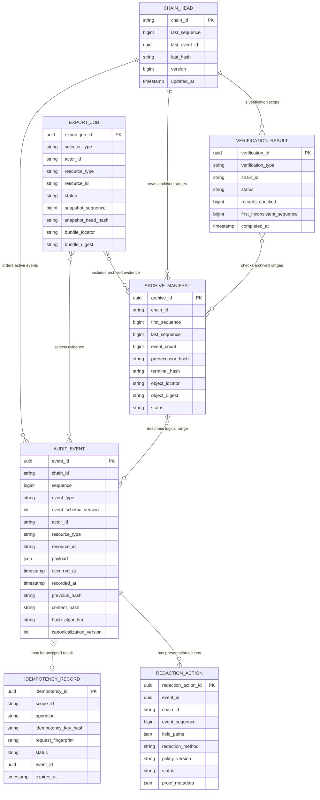
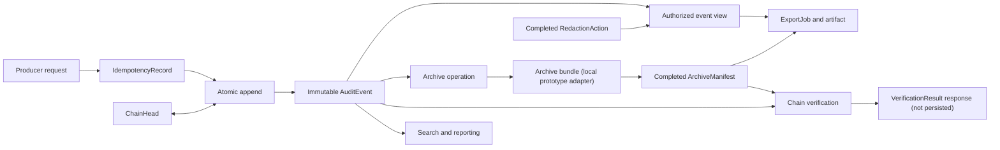

# Domain model diagrams

The diagrams show logical ownership and evidence flow. A relationship to an archived or missing event is deliberately not always a physical foreign key.

## Entity relationships

### Relationship notes

- `ChainHead` to active `AuditEvent` is enforced by chain identity and the unique `(chain_id, sequence)` constraint; an append changes both in one transaction.
- `ArchiveManifest` identifies an event range logically. Physical foreign keys to first or last events would prevent legitimate archival removal.
- References from `RedactionAction`, `VerificationResult`, and `ExportJob` must remain meaningful after archival or when verification reports a missing event. They therefore use stable identifiers and proof metadata; physical foreign keys are conditional on the chosen retention design.
- The many-to-many lines for exports and verification express evidence inclusion. Join tables are required only if the prototype persists item-level membership rather than reproducible selectors and boundary metadata.

## State and evidence flow

Only the append path requires a synchronous transaction for event creation and head advancement. Verification, archival, and export may run asynchronously if their APIs expose job state and preserve stable boundaries. Redaction authorization and its evidence record must complete before a redacted response is presented.
